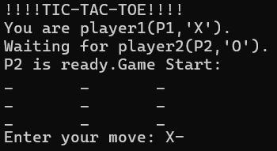

# Tic-Tac-Toe (TCP Sockets, C++)

A simple client–server Tic-Tac-Toe game built using TCP sockets in C++.  
This project demonstrates basic socket programming, message passing, and turn-based game logic between two connected players.

---

## Preview



---

## Features
- Two-player client/server gameplay over TCP  
- Move validation and win/draw detection  
- Text-based terminal interface  
- Clean, minimal C++ codebase for learning networking fundamentals  
- Cross-platform build support using CMake  

---

## Requirements
- Linux or WSL (Ubuntu/Debian recommended)  
- CMake 3.10+  
- g++ with C++17 support  

---

## Build Instructions

This project uses CMake.

```bash
mkdir build
cd build
cmake ..
cmake --build .
```

---

## Run Instructions

Open two terminals.

Terminal 1 (Server):
```bash
./server
```

Terminal 2 (Client):
```bash
./client
```


Note: Both programs must run on the same machine, or on machines that can communicate over the configured port.

---

## Project Structure

```bash
.
├── client.cpp
├── server.cpp
├── game_fun.cpp
├── game_fun.h
├── CMakeLists.txt
├── README.md
├── LICENSE
└── assets/
    └── screenshot.png
```
---
